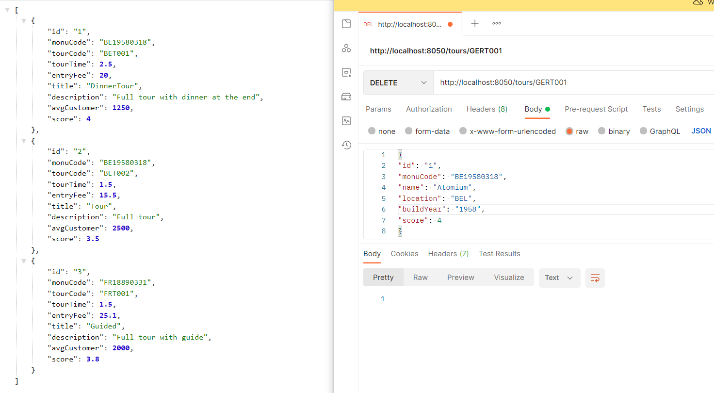

# AdvProg-Edge

## Korte beschrijving:
Wij hebben voor het thema van **monumenten** en **rondleidingen** gekozen. Hier bovenop hebben we nog een 
extra service toegevoegd, namelijk **tickets**. Een bezoeker kan een ticket aankopen die bij een
rondleiding hoort. Deze rondeleiding behoort tot een monument. 

Een monument kan meerdere
rondleidingen bevatten, deze worden gekoppeld aan elkaar met behulp van een code (MonuCode). Een
ticket wordt op dezelfde manier gekoppeld aan een rondleiding (TourCode).

## Diagram microservices architectuur :

## SwaggerUI EdgeService:

## Code Coverage:
### EdgeService Tests

POST,PUT,DELETE niet inbegrepen*
### MonumentService Tests:

### TourService Tests:

### TicketService Tests:

### Github Repo's:
- [Edge service](https://github.com/RubenBoone/AdvProg-Edge)
- [Monument microservice](https://github.com/RubenBoone/AdvProg-Monument)
- [Tour microservice](https://github.com/RubenBoone/AdvProg-Tour)
- [Ticket microservice](https://github.com/RubenBoone/AdvProg-Ticket)
- [Angular Frontend](https://github.com/PeetersJ2010/APT-Frontend)

## Postman test voor endpoints
### GET
#### /monuments

#### /monuments/{monuCode}

#### /tours

#### /tours/{tourCode}

#### /tickets

#### /tours/popular

#### /tours/best

#### /monuments/oldest

#### /monuments/newest

#### /tours/price/{price}

### POST
#### /monuments

#### /tours

#### /tickets

### PUT
#### /monuments

#### /tours

## DELETE
#### /monuments/{monuCode}

#### /tours/{tourCode}

